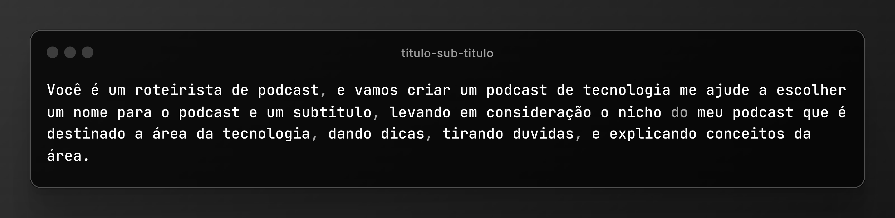
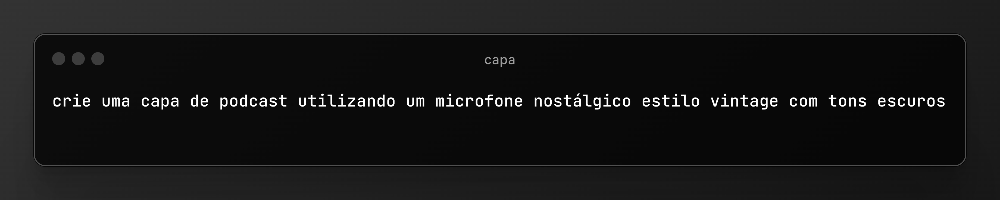
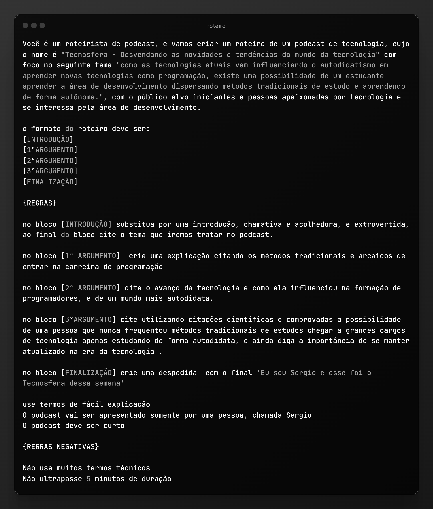

# Projeto Podcast gerado por IA 
O objetivo deste projeto é apresentar o método utilizado na criação do podcast.

O podcast não foi adicionado a nenhuma plataforma de streaming. No entanto, você pode baixá-lo através do link abaixo:

🎙️ Clique [aqui](https://github.com/SergioSinhoca/projeto-podcast/blob/main/media/podcast.mp3) para acessar o podcast.

## 💻 Tecnologias utilizadas 
- [Copilot](https://copilot.microsoft.com/) 
- [Gemini](https://gemini.google.com/)
- [Tagmp3](https://tagmp3.net/)
- [Capcut](https://www.capcut.com/pt-br/)
- [Canva](https://www.canva.com/)
- [ElevenLabs](https://elevenlabs.io/)

## 🛠️ Como foi desenvolvido ?

- Título, subtítulo e roteiro gerados na **Gemini**.
- Imagem de capa gerada no **Copilot**.
- Áudio gerado no **ElevenLabs**.
- Edição da música e fundo musical feitos no **Capcut**.
- Edição da capa feita no **Canva**.
- Metatags e capa do arquivo mp3 adicionadas utilizando o **Tagmp3**.

## 🤖 Prompts utilizados

Prompts utilizado na criação do projeto.

---

<h3 align="center">Prompt do título e subtítulo</h3>

<h3 align="center">Prompt da imagem de capa</h3> 

<h3 align="center">Prompt do roteiro</h3> 

